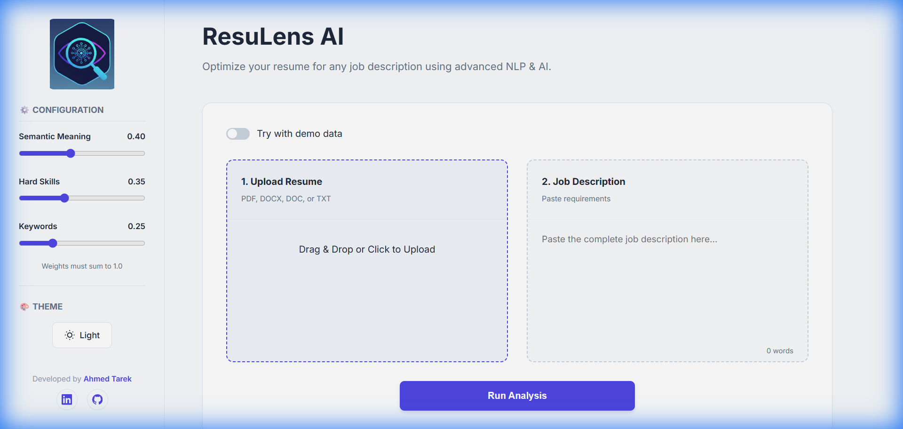
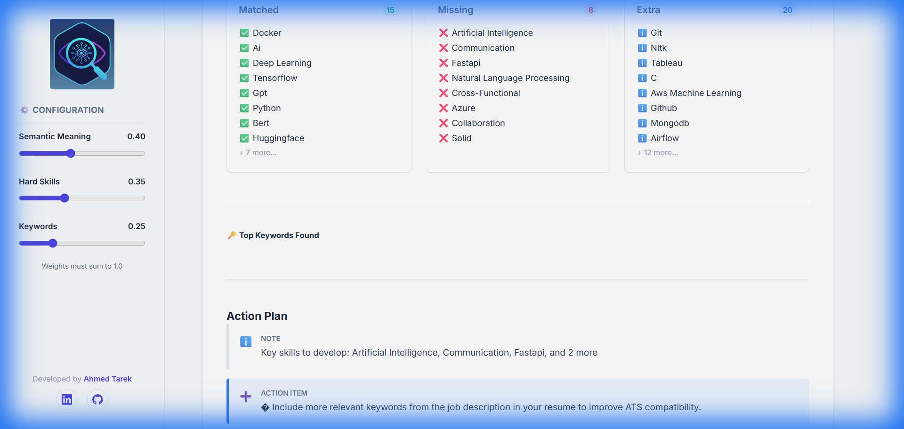

<div align="center">

#  ResuLens AI

### Intelligent Resume-to-Job Matching Powered by NLP & Machine Learning

[](https://resulens-ai.onrender.com)
[](https://python.org)
[](https://flask.palletsprojects.com)
[](LICENSE)

**Transform your job search with AI-powered resume analysis that goes beyond simple keyword matching.**

[Live Demo](https://resulens-ai.onrender.com) • [Features](#-features) • [Installation](#-quick-start) • [Tech Stack](#-tech-stack) • [Author](#-author)

</div>

---

## 🎬 Demo

<div align="center">
  
  <p><em>Complete analysis workflow: Upload → Analyze → Get actionable insights</em></p>
</div>

---

## ✨ Features

###  Multi-Dimensional Analysis
- **Semantic Matching** — BERT-powered understanding of context and meaning
- **Skill Extraction** — Smart detection of technical and soft skills
- **Keyword Analysis** — TF-IDF based ATS compatibility scoring

###  Interactive Dashboard
- **Real-time Score Gauge** — Instant overall match percentage
- **Radar Charts** — Visual breakdown across all dimensions
- **Skill Gap Analysis** — Matched, Missing, and Extra skills at a glance

###  Powerful Tools
- **Configurable Weights** — Adjust scoring priorities with live updates
- **PDF Report Export** — Download detailed analysis for sharing
- **Demo Mode** — Try instantly with sample data

###  Actionable Insights
- **Smart Action Plan** — Prioritized recommendations
- **Keyword Suggestions** — Improve ATS compatibility
- **Experience Gap Detection** — What skills to develop next

---

##  Screenshots

<div align="center">
  <table>
    <tr>
      <td align="center"><br/><em>Clean Modern Interface</em></td>
      <td align="center"><br/><em>Analysis Results Dashboard</em></td>
    </tr>
  </table>
</div>

---

##  Quick Start

### Prerequisites
- Python 3.8 or higher
- pip (Python package manager)

### Installation

```bash
# Clone the repository
git clone https://github.com/ahmedtarek-mel/ResuLens-AI.git
cd ResuLens-AI

# Install dependencies
pip install -r requirements.txt

# Run the application
python app.py
```

Open your browser and navigate to `http://localhost:5000`

---

##  How It Works

ResuLens AI uses a **hybrid scoring algorithm** combining three NLP techniques:

```
Final Score = (Semantic × 0.40) + (Skills × 0.35) + (Keywords × 0.25)
```

| Component | Technology | Purpose |
|-----------|-----------|---------|
| **Semantic Analysis** | BERT (`all-MiniLM-L6-v2`) | Understand meaning beyond keywords |
| **Skill Matching** | Custom NER + Pattern Matching | Extract and compare technical skills |
| **Keyword Scoring** | TF-IDF Vectorization | Ensure ATS compatibility |

<details>
<summary><strong>🔬 Technical Deep Dive</strong></summary>

### Semantic Layer
Uses Sentence Transformers to encode resumes and job descriptions into 384-dimensional vectors, then calculates cosine similarity to measure contextual alignment.

### Skill Extraction
Combines dictionary-based NER with regex patterns to identify 500+ technical skills, frameworks, and tools from a curated taxonomy.

### Keyword Analysis
TF-IDF vectorization identifies critical terms in job descriptions and measures their presence in resumes for ATS optimization.

</details>

---

##  Tech Stack

| Layer | Technology |
|-------|------------|
| **Backend** | Flask, Python 3.8+ |
| **NLP/ML** | Sentence-Transformers, spaCy, scikit-learn |
| **Frontend** | HTML5, CSS3, JavaScript |
| **Visualization** | Plotly.js |
| **PDF Generation** | FPDF2 |
| **Deployment** | Render / Any WSGI Server |

---

## 📁 Project Structure

```
ResuLens-AI/
├── app.py                 # Flask application entry point
├── config.yaml            # Application configuration
├── requirements.txt       # Python dependencies
├── src/                   # Core logic modules
│   ├── nlp/              # Text processing & embeddings
│   ├── matching/         # Scoring algorithms
│   ├── parsers/          # Document parsers (PDF, DOCX)
│   └── reports/          # PDF report generation
├── static/               # Frontend assets
│   ├── css/             # Stylesheets
│   └── js/              # JavaScript
├── templates/            # HTML templates
├── tests/                # Unit tests
└── assets/               # Demo media
```

---

##  Running Tests

```bash
pytest tests/ -v
```

---

## 🌐 Deployment

The app is production-ready and can be deployed to:

- **Render** 

## 🗺️ Roadmap

- [ ] LinkedIn profile import
- [ ] Batch resume analysis
- [ ] Job recommendation engine
- [ ] API endpoints for integrations
- [ ] Multi-language support

---

## 👤 Author

<div align="center">

**Ahmed Tarek**

*Data Scientist & Machine Learning Engineer*

[](https://github.com/ahmedtarek-mel)
[](https://linkedin.com/in/ahmed-tarek-mel)
[](mailto:ahmedtarekmel@gmail.com)

*"Turning complex data into clear, strategic intelligence."*

</div>

---

## 📄 License

This project is licensed under the MIT License — see the [LICENSE](LICENSE) file for details.

---

<div align="center">

**⭐ Star this repo if you find it helpful!**

Made with ❤️ by [Ahmed Tarek](https://github.com/ahmedtarek-mel)

</div>
